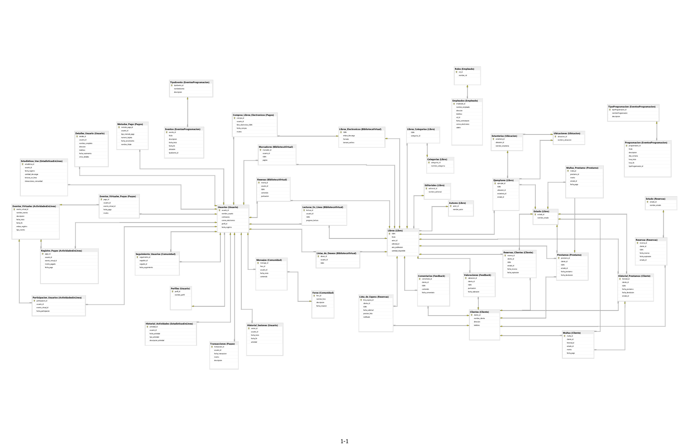

# Base de Datos de Biblioteca

Este proyecto consiste en una base de datos diseñada para una biblioteca, implementada en SQL Server. Proporciona una estructura básica para administrar libros, usuarios, préstamos, eventos y más.

## Diseño del Diagrama Entidad-Relación

El diseño de la base de datos se encuentra en el archivo . Este diagrama muestra las entidades principales y las relaciones entre ellas en el modelo de la base de datos.

## Archivos SQL

El proyecto incluye varios archivos SQL para crear y poblar la base de datos, así como para realizar consultas y definir vistas:

1. **01_Creacion_Base_Datos.sql**: Este script reinicia la base de datos, eliminando y volviendo a crear todas las bases de datos necesarias.
2. **02_Creacion_Schemas_Tablas.sql**: Define los esquemas y tablas necesarios para la base de datos.
3. **03_Completar_Tablas_1.sql**, **04_Completar_Tablas_2.sql** y **05_Completar_Tablas_3.sql**: Estos scripts llenan las tablas con datos ficticios proporcionados por IA y algoritmos aleatorios en Python.
4. **06_Consultas.sql**: Contiene una serie de consultas SQL que responden a preguntas sobre la base de datos y proporcionan información útil.
5. **07_Vistas.sql**: Define una serie de vistas que ofrecen diferentes perspectivas sobre los datos de la base de datos.

## Tecnologías y Skills Utilizadas

En este proyecto se utilizaron las siguientes tecnologías y skills:

## Consideraciones

- Este proyecto es básico y puede contener errores de lógica o redundancia. Se recomienda revisar y ajustar según sea necesario para su uso específico.
- Se asume que el entorno de implementación es SQL Server. Es posible que se requieran ajustes para utilizar en otros sistemas de gestión de bases de datos.

## Contribuciones

Si encuentras algún error o tienes sugerencias de mejora, ¡no dudes en abrir un issue o enviar un pull request!
