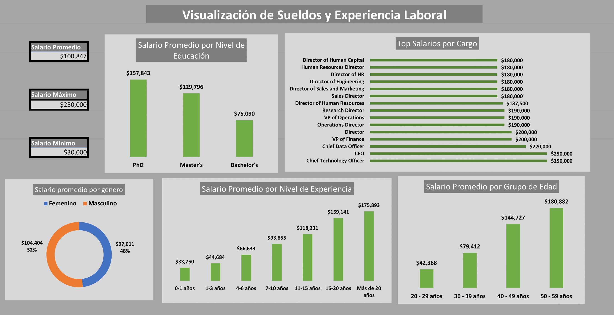

# Proyecto de Visualización de Datos de Salarios y Experiencia Laboral

Este proyecto básico se centra en la visualización de datos relacionados con salarios y experiencia laboral utilizando un conjunto de datos del archivo "Salary Data.csv". La visualización se realiza a través de un dashboard y tablas que se encuentran en el archivo "Visualización de Sueldos y Experiencia Laboral.xlsx". El objetivo principal es explorar y presentar de manera clara y efectiva las relaciones entre diferentes variables relacionadas con los salarios y la experiencia laboral.

## Archivos Incluidos

- **Visualización de Sueldos y Experiencia Laboral.xlsx**: Este archivo contiene el dashboard y las tablas con las visualizaciones de datos.
- **Salary Data.csv**: Conjunto de datos utilizado para la visualización.
- **DashBoard.png**: Imagen del dashboard generado.

## Visualizaciones Incluidas

El archivo "Visualización de Sueldos y Experiencia Laboral.xlsx" contiene las siguientes visualizaciones:

1. **Salario Promedio por Nivel de Educación**: Visualización que muestra el salario promedio agrupado por nivel de educación.
2. **Salario Promedio por Cargo**: Visualización que muestra el salario promedio agrupado por cargo.
3. **Salario Promedio por Nivel de Experiencia**: Visualización que muestra el salario promedio agrupado por nivel de experiencia.
4. **Salario Promedio por Grupo de Edad**: Visualización que muestra el salario promedio agrupado por grupo de edad.

